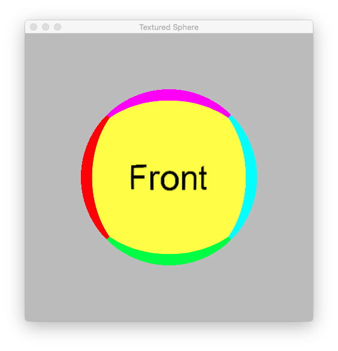

## Texturing a sphere

There are 2 ways of texturing a sphere. One way is to apply a cubemap and the second way is to apply a 2D equirectangular texture. In either case, an interpolated 3D vector must be passed to the fragment shader. The interesting thing is, unlike other 3D objects, the normal attribute of a vertex on the surface of the sphere is the normalized vector of its position attribute. In other words, either one can be used as a direction vector.

The main purpose of this project is not the process of texturing a sphere but to apply quaternions to control the rotation of a 3D object. Apple has developed a simd library which supports vectors, matrices and quaternions. 

The following types in the APPLMath Utilities is type-defined to those in the simd library:

```objc
    vector_float3 - simd_float3
```

```objc
matrix_float4x4 - simd_float4x4
```

However, Apple's Metal Shading Language has no-built quaternion type. We have to use the simd function:

```objc
    simd_float4x4 simd_matrix4x4(simd_quatf q)
```

to convert an instance of simd_quatf to a matrix_float4x4 object and pass the resulting matrix to the shader functions as a uniform. This simd call is only available in macOS 10.13+ and iOS 11.0+


The implementation of a virtual trackball/arcball had been proposed by M. Chen, S.J. Mountford, and A. Sellen in 1988, Gavin Bell in 1988 and by K. Shoemake in 1992. In a nutshell, a virtual trackball/arcball is a user interface for rotating a 3D object by using just a mouse.

The implementation of the Virtual Camera of this project is based on a number of sources. The aim is to build a simple interface which is robust so that the code can be imported into over projects with as minimal modification as possible.

There are 2 Objective-C methods which are called continously during a mouse drag and are critical to the operation of the virtual camera.

```objc
    -(simd_quatf) rotationBetweenVector:andVector:


    -(vector_float3) projectMouseX:andY:
```

The first method will return a normalized rotation quaternion (unit quaternion) while the second method takes a pair of mouse coordinates and projects them onto a virtual sphere of radius 1.0 and returns a 3D point.
<br />
<br />



<br />
<br />
<br />

Bug fix to the pinchGestureDidRecognize method.
<br />
<br />

**Requirements:** XCode 9.x and macOS 10.13+ or later iOS 12+
<br />
<br />

Note: Layer rendering is supported on physical devices and then only on iOS 12+.

**References:**

https://www.khronos.org/opengl/wiki/Object_Mouse_Trackball

http://lolengine.net/blog/2013/09/18/beautiful-maths-quaternion-from-vectors

http://www.songho.ca/opengl/gl_camera.html

http://www.opengl-tutorial.org/intermediate-tutorials/tutorial-17-quaternions/

https://www.xarg.org/proof/quaternion-from-two-vectors/

https://www.khronos.org/opengl/wiki/Texturing_a_Sphere

"Virtual Trackballs Revisited" by Knud Henriksen, Jon Sporring, and Kasper Hornbæk

https://cgvr.cs.uni-bremen.de/teaching/cg_literatur/Cube_map_tutorial/cube_map.html

The source code of Gavin Bell's implementation is still available at the above website.

http://simonrodriguez.fr/dragon/

There is a camera class in the Metal version.
